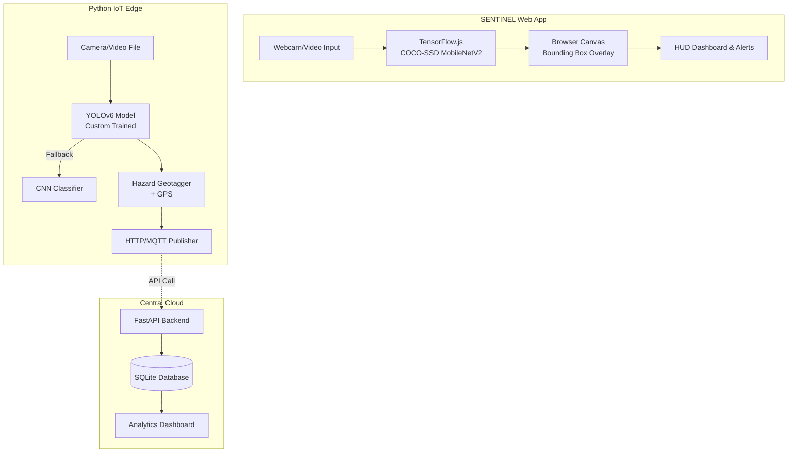

# 🚗 Dynamic Road Hazard Detection: Dual-Architecture AI & IoT Pipeline

A state-of-the-art dual-architecture system for comprehensive road hazard and traffic object detection. This repository combines a **Python edge/cloud backend** utilizing YOLOv6 and an IoT pipeline, with a **React-based browser frontend (SENTINEL)** powered by TensorFlow.js.

---

## 🌐 Project Website & Live Demo

- **SENTINEL AI Dashboard**: [https://sentinel-road-hazard-ai.vercel.app](https://sentinel-road-hazard-ai.vercel.app)

---

## 1. Project Overview

This project provides two interconnected solutions for smart city and autonomous vehicle tracking:

1. **SENTINEL (Frontend App)**: A highly-optimized React web application running TensorFlow.js (COCO-SSD / MobileNetV2) entirely in the browser. It tracks 80 object classes (pedestrians, vehicles, traffic lights) with zero server latency. It features a cyberpunk HUD aesthetic with three modes: live webcam, image scan, and video upload.
2. **YOLOv6 IoT Pipeline (Backend System)**: A Python-based computer vision edge application designed to detect critical road anomalies (potholes, road cracks, speed breakers, waterlogging, debris). It geotags hazards using GPS and pushes events over HTTP/MQTT to a centralized FastAPI server for analytics.

---

## 2. Architecture & Models



### 🧠 The Models
*   **TensorFlow.js COCO-SSD (Frontend)**: Runs instantly on any device via the browser. Pre-trained on the COCO dataset to detect 80 everyday objects. Highly optimized for high FPS without heavy GPU requirements.
*   **YOLOv6 (Backend)**: Custom-trained on a curated dataset specifically for road hazards not covered by COCO. Optimized for edge deployment on autonomous vehicle hardware (e.g., NVIDIA Jetson).

---

## 3. Dataset Information

The system relies on two distinct datasets:

1. **Custom Road Hazards Dataset (Roboflow)**
   - Used to train the backend YOLOv6 detector.
   - **Classes**: `pothole`, `speed_breaker`, `road_crack`, `waterlogging`, `debris`
   - Data is augmented with horizontal flipping, rotation, and brightness jitter to ensure robustness in various weather and lighting conditions.

2. **Common Objects in Context (COCO)**
   - The foundation of the SENTINEL frontend.
   - Detects pedestrians, bicycles, cars, motorcycles, buses, trucks, traffic lights, stop signs, and animals.
   - Used to alert drivers of immediate obstacles and dynamic traffic agents.

---

## 4. Repository Structure

This repository uses a monorepo structure:

```text
Dynamic-Road-Hazard-Detection/
│
│── frontend/               # React + Vite SENTINEL Web App
│   │── src/
│   │   │── components/     # HUD, Scanner, Legend UI
│   │   │── hooks/          # TensorFlow.js integration
│   │   │── utils/          # Canvas bounding box logic
│   │── package.json
│   │── tailwind.config.js
│
│── backend/                # Python AI & IoT System
│   │── data/               # YOLO dataset structure
│   │── models/             # PyTorch weights
│   │── src/
│   │   │── detection/      # YOLOv6 inference & training
│   │   │── classification/ # Fallback CNN logic
│   │   │── iot/            # GPS & MQTT/HTTP publishers
│   │   │── backend/        # FastAPI server
│   │── configs/
│   │── main.py
│   │── requirements.txt
```

*(Note: The Python source code remains in the root/src directory as standard.)*

---

## 5. Setup & Execution Instructions

### A. Running the SENTINEL Frontend Locally

1. Navigate to the frontend directory:
   ```bash
   cd frontend
   ```
2. Install dependencies:
   ```bash
   npm install
   ```
3. Start the Vite development server:
   ```bash
   npm run dev
   ```
   *The app will launch at `http://localhost:5173`.*

### B. Running the Python Backend & IoT Pipeline

1. Return to the root directory and create a virtual environment:
   ```bash
   python -m venv .venv
   source .venv/bin/activate  # Linux/macOS
   # .venv\Scripts\activate   # Windows
   ```
2. Install dependencies:
   ```bash
   pip install -r requirements.txt
   ```
3. **Start the FastAPI Backend Server**:
   ```bash
   python main.py --mode server
   ```
4. **Run the YOLOv6 Edge Detector** (in a new terminal):
   ```bash
   python main.py --mode detect --display
   ```

---

## 6. Training the Custom YOLOv6 Model

If you wish to retrain the road hazard model on your own Roboflow export:

1. Clone the official YOLOv6 repository into `models/`:
   ```bash
   git clone https://github.com/meituan/YOLOv6.git models/YOLOv6
   pip install -r models/YOLOv6/requirements.txt
   ```
2. Prepare your data in standard YOLO format inside the `data/` folder and update `configs/config.yaml`.
3. Start training:
   ```bash
   python -m src.detection.yolov6_train --data-yaml data/dataset.yaml --epochs 80 --batch-size 16 --img-size 640 --device cuda
   ```

---

## 7. Production Notes & Future Scope

- **Frontend Scalability**: The SENTINEL web app can be modified to accept WebRTC streams from the backend rather than using local webcams, centralizing inference.
- **Hardware Integration**: Implement real NMEA GPS modules via serial port in `src/iot/gps_module.py`.
- **Security**: The FastAPI backend currently runs unauthenticated. For production deployment, implement JWT validation before accepting hazard payloads.

---
*Built for the future of autonomous safety and smart infrastructure.*
